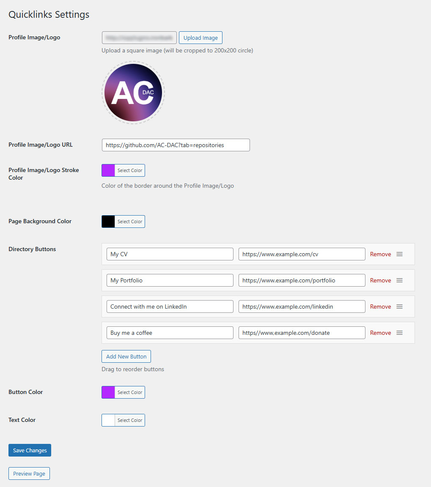
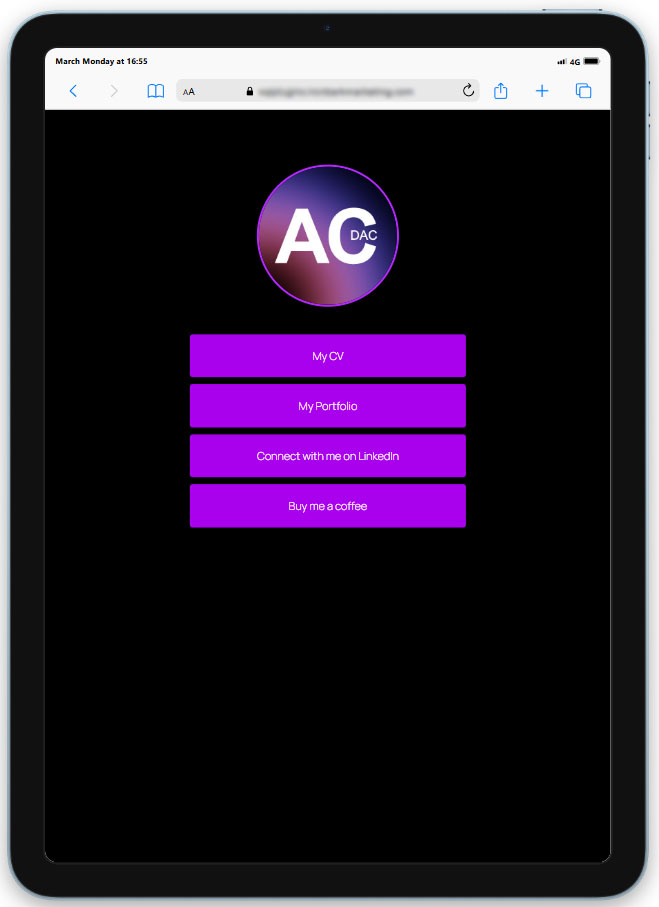

# Quicklinks (Public)

A WordPress plugin that creates a dedicated landing page for sharing shortcut links on your website (e.g. `yourdomain.com/quicklinks/`).

Built by [Alex Chuc](https://github.com/AC-DAC) for [Ironbark Marketing](https://www.ironbarkmarketing.com).

---

## Screenshots

| Settings | Mobile | Tablet |
|----------|--------|--------|
|  |  |  |

---

## Features

- **Customisable** — Add a profile logo/image, background colour, and button colours
- **Drag and drop** — Rearrange links quickly without touching any code
- **SEO-friendly** — Links are served from your own domain

---

## Requirements

- WordPress 5.6 or higher
- PHP 7.4 or higher
- Tested up to WordPress 6.9.4

---

## Installation

1. Download the plugin zip from the [latest release](https://github.com/AC-DAC/Quicklinks/releases/latest)
2. In WordPress admin, go to **Plugins → Add New → Upload Plugin**
3. Upload the zip and click **Install Now**
4. Activate the plugin
5. Go to the **Quicklinks** menu item in the WordPress sidebar to configure

On first save, the plugin automatically creates a page at `/quicklinks/` with the shortcode pre-inserted.

---

## Usage

- Upload a profile image and set optional link colours via **Quicklinks → Settings**
- Add, remove, and reorder directory buttons using drag and drop
- Visit `yourdomain.com/quicklinks/` to see the live page

> Do not delete the auto-created Quicklinks page — the plugin requires it to render correctly.

---

## CI/CD Pipeline

Defined in `.github/workflows/quicklinks-release.yml`.

Three-job chain on version tag push (`v*.*.*`):

```
validate → package → release
```

- **validate** — runs PHPCS against plugin source enforcing WordPress Coding Standards (WPCS 3.x), plus `php -l` syntax check
- **package** — zips plugin source into a versioned artifact
- **release** — creates a GitHub Release with the zip attached, version extracted from plugin metadata

PHPCS configuration in `phpcs.xml`. Dependencies pinned in `composer.json` (PHPCS 3.x + WPCS 3.x). Codebase fully compliant with WordPress Coding Standards.

---

## Tech Stack

| Layer | Technology |
|-------|-----------|
| Language | PHP |
| Standards | WordPress Coding Standards (WPCS 3.x) |
| Linting | PHPCS 3.x |
| CI/CD | GitHub Actions → GitHub Releases |
| Packaging | zip artifact |

---

## License

Copyright © Ironbark Marketing. All rights reserved. Proprietary — not for redistribution.
